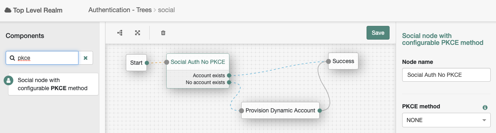

<!--
 * The contents of this file are subject to the terms of the Common Development and
 * Distribution License (the License). You may not use this file except in compliance with the
 * License.
 *
 * You can obtain a copy of the License at legal/CDDLv1.0.txt. See the License for the
 * specific language governing permission and limitations under the License.
 *
 * When distributing Covered Software, include this CDDL Header Notice in each file and include
 * the License file at legal/CDDLv1.0.txt. If applicable, add the following below the CDDL
 * Header, with the fields enclosed by brackets [] replaced by your own identifying
 * information: "Portions copyright [year] [name of copyright owner]".
 *
 * Copyright 2020 ForgeRock AS.
-->

# Forgerock Social PKCE Config Node

A simple authentication node for ForgeRock's [Identity Platform](https://www.forgerock.com/) 6.5.2 and above.

This node basically works as the standard Social Authentication nodes except that it allows the configuration of the Proof Key for Code Exchange method. This might be needed to ensure backwards compatibility with legacy OAuth providers that do not support PKCE and therefore cannot handle request parameters such as `code_challenge`, `code_challenge_method` or `code_verifier`.

While some implementations ignore the parameters, others throw errors. This authentication node allows PKCE to be completely disabled, hence none of the above parameters will be sent to the OAuth provider.

## Installation

Copy the .jar file from the `target` directory into the `/path/to/web-container/webapps/openam/WEB-INF/lib` directory where AM is deployed.  Restart the web container to pick up the new node.  The node will then appear in the authentication trees components palette.

## Configuration

To use this node, in the AM administration interface, navigate to the realm, select `Authentication` > `Trees` from the navigation and click on `Create Tree`. Within the tree designer, drag the `Social node with configurable PKCE method` to the main area, configure it so it suits your requirements.

Specify the desired PKCE method, which can be one of `NONE`, `PLAIN` or `S256`. `NONE` disables PKCE completely.

For more information on how to configure Social Authentication Nodes, refer to the [AM documentation](https://backstage.forgerock.com/docs/am/7/authentication-guide/auth-node-configuration-hints.html#federation-authn-nodes).

## Usage

The code in this repository has binary dependencies that live in the ForgeRock maven repository. Maven can be configured to authenticate to this repository by following the following [ForgeRock Knowledge Base Article](https://backstage.forgerock.com/knowledge/kb/article/a74096897).
